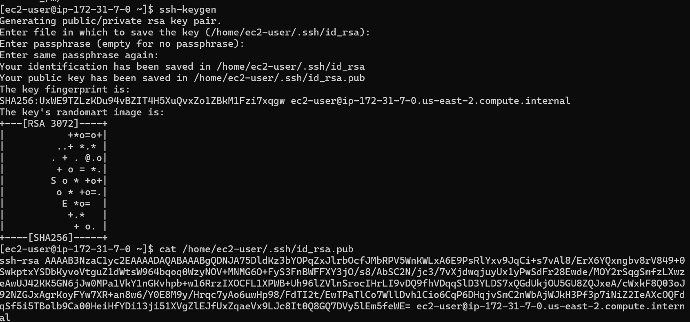
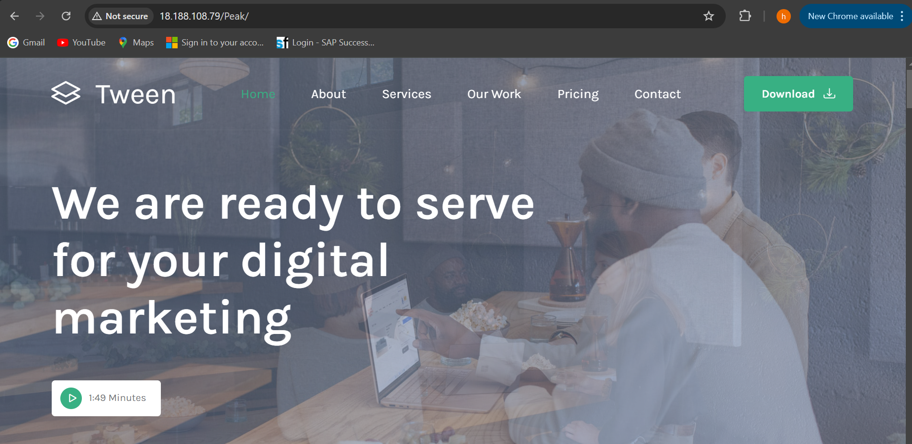

# __Capstone Project-Introduction to Cloud Computing__

# Capstone Project: E-Commerce Platform Deployment with Git 

# Project Instruction

# In this project I will be developing an e-commerce website for a new online marketplace named "MarketPeak." This platform will feature product listings, a shopping cart, and user authentication.To implement this project I will use Git for version control, the develpoment platform will be in a Linux environment, and deploy it on an AWS EC2 instance.

# Task 1: Implement Version Control with Git

# 1.1: Initialize Git Repository

# I started by creating a project directory named MarketPeak_Ecommerce, and i initialized a Git repository inside it to manage my version control as shown in the screenshot.

# 1.2: Obtain and Prepare the E-Commerce Website Template

# This step involves downloading a website template instead of devloping the website fro scartch. This was achieved by visiting [https://www.tooplate.com/] to download specific template as shown in the image below.

# After downloading the website template, I extracted the downloaded template with the name peak into my project directory.

# 1.3: Stage and Commit the Template to Git

# In this step, I added the website template to my Git repository, configured my email & username and commited the changes with a clear, descriptive message as seen in the images below.

# 1.4: Push the Code to my GitHub Repository.

# This step shows how I pushed my code to my newly created GitHub repository, this involves creating a repository named MarketPeak_Ecommerce in my GitHub account, adding my remote repository URL to my local repository configuration, branched into the main branch and pushed my code to the main branch on my GitHub repository as shown in the images below.

# Task 2: AWS Deployment

# 2.1: Set up an AWS EC2 Instance

# In this step, I logged in to my AWS console to launch an EC2 instance which i connected to using SSH as shown in the images below.

# 2.2: Clone my Remote Repository on a Linux server

# This process involves authenticating with GitHub and choosing between two methods of cloning; the SSH method and HTTPS method, in this case we used the SSH method. This method involves generating an SSH kep pair using the command ssh-keygen on my EC2 instance, after which we I used the command cat /home/ec2-user/.ssh/id_rsa.pub to display the generated ssh key before copying it and adding it to GitHub repository. The next step after that was to clone my repository on my EC2 instance with the command 
# git clone git@github.com:Drbombayng/MarketPeak_Ecommerce.git 
# All these steps are displayed in the images below.

# 2.3: Install a Web Server on EC2

# Installing Apache HTTP Server also known as httpd on my linux EC2 server allows me to host the MarketPeak_Ecommerce site. To install httpd, I used the command 
# sudo yum update -y
# sudo yum install httpd -y
# sudo systemctl start httpd
# sudo systemctl enable httpd

# The result of the above commands is shown in the images below.

# 2.4: Configure httpd for Website

# To serve the website from my EC2 instance, I configured httpd to point to the directory on my linux server where the website code files are stored, usually in /var/www/html. To achieve this, I prepared the web directory by clearing the default httpd web directory and copy MarketPeak_Ecommerce webstite files to it with the command
# sudo rm -rf /var/www/html/*

# After that, I applied the changes using the command
# sudo cp -r ~/MarketPeak_Ecommerce/* /var/www/html/

# This result of the above commands is displayed in the image below

# 2.5: Access Website from Browser

# With httpd configured and website files in place, the MarketPeak_Ecommerce platform is now live on the internet. To view this website, I copied the public IP address of my instance from my AWS console to a browser and added the name of the folder in which the website files was stored in ec2 instance on linux server as shown in the image below

# Task 3: Continuous Integration and Deployment Workflow

# 3.1: Developing new features and fixes.

# In this step I created a new branch named decelopment on my ec2 instance with the command

# git branch development
# git checkout development

# This enabled me to implement changes such as updating web pages, adding new products or fixing known issues as displayed in the image below

 

# 3.2: Version Control with Git

# In this step, I staged my changes, commited the changes and pushed to my remote repository on GitHub with the following commands

# git add .
# git commit -m "Add new features or fix bugs"
# git push origin development

# This is displayed in the images below

# 3.3: Pull Request and Merging to the Main Branch

# In this step I checked out to main branch, merged the development branch into it and pushed the updated main branch to my GitHub repository as shown in the images below.

# 3.4: Deploying Updates to the Production Server

